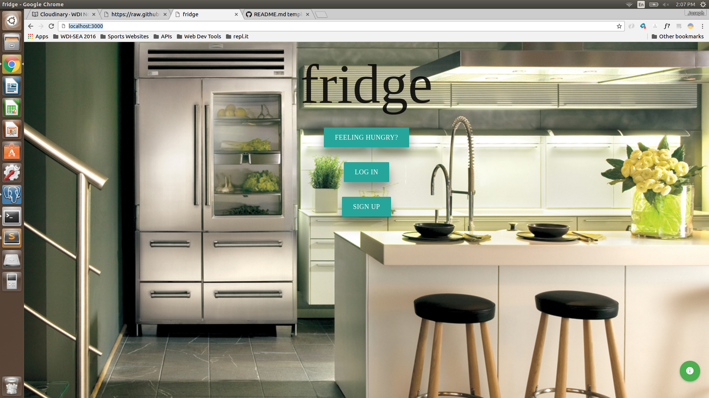
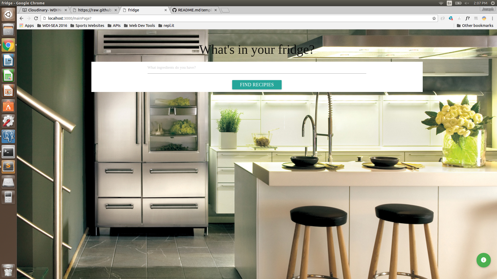
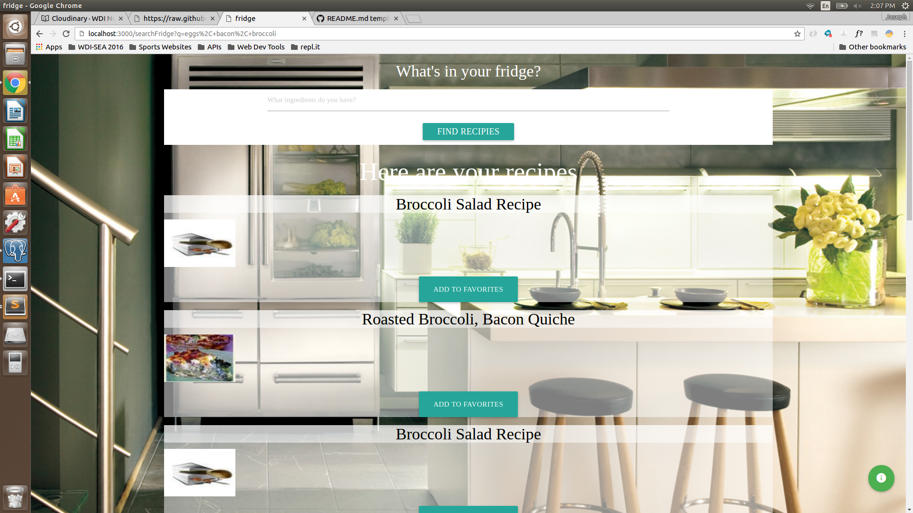
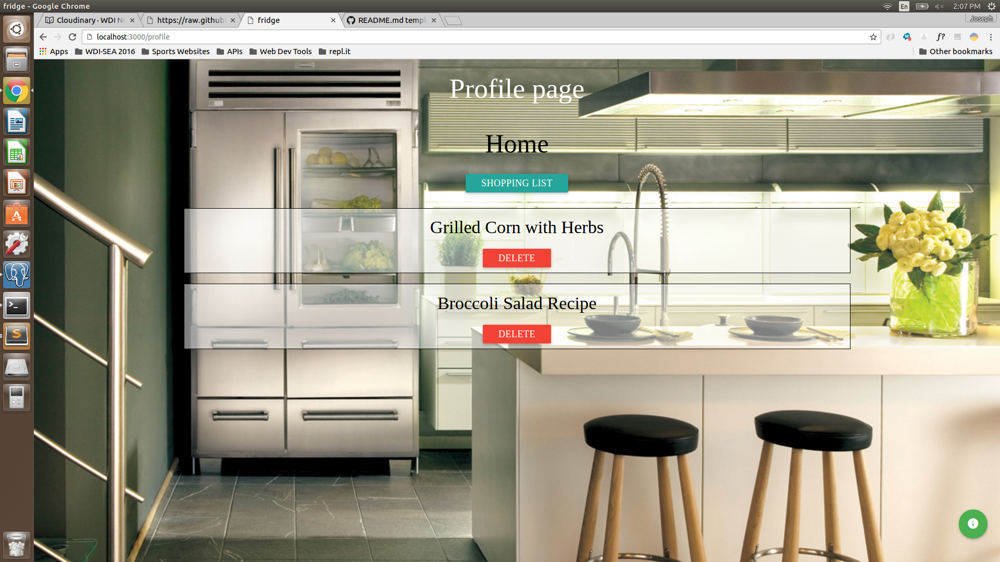
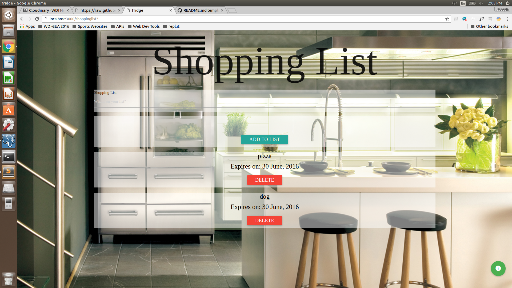

# fridge

## What's in your fridge?

Have you ever stood in front of your fridge and didn't know what to eat? The fridge might have food in it, but still nothing comes to mind. The **fridge** app is the answer to all your recipe questions. 

Just enter the ingredients in the **fridge** search bar and receive the best recipes the web can offer. 

## Motivation

I was standing in front of my **fridge** one evening after work and had no idea what to eat with the food in **fridge**. I thought to myself, "I wish I had an app for that!". Now I do have an app for that. **fridge**

## Screenshots

### Features
* A user can search for recipes using the ingredients they have in their fridges.
* A user can create build up a collection of recipes and save them to their profile to view later.
* A user can create a shopping list and enter in an expiration date. This data can be saved for later use.
* Images of the recipes and a link to their recipes are taken from the API. 

### Credits
* [jQuery](http://jquery.com)
* [jQuery UI](http://jqueryui.com)
* [Google Web Fonts - 'Robot Salb', serif](http://google.com/fonts)
* [Materialize](http://materializecss.com/)
* [Recipe Puppy API](http://www.recipepuppy.com/api/)

### Known Issues
* none

### Disclaimer
**fridge** is an original app from [Joe Marzullo](https://github.com/joemarzullo/). 